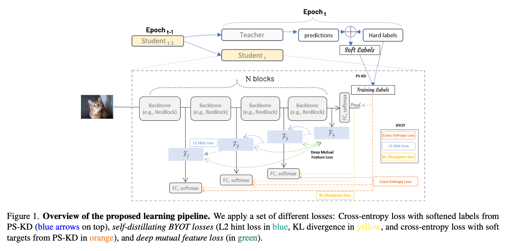

[](https://www.lgcns.com/En/Home)
[](https://pytorch.org/)

# Progressive Self-Knowledge Distillation with Mutual Learning
* PyTorch implementation of **Progressive Self-Knowledge Distillation with Mutual Learning**.  
[[`Slides`](https://docs.google.com/presentation/d/1V0aSEbBalg8lnKeg6NVcS9FPs3CAw2xy/edit?usp=sharing&ouid=104359145724275927049&rtpof=true&sd=true)] [[`Paper`](https://github.com/s6007541/Progressive-Self-Knowledge-Distillation-with-Mutual-Learning/blob/main/pdf_files/PSKD_ML.pdf)] 

## Abstract
Deep neural networks based on large network architectures are often prone to the over-fitting problem and thus inadequate for generalization. Recent self-knowledge distillation (self-KD) approaches have successfully addressed this issue by regularizing a single network using dark knowledge (e.g., knowledge acquired from wrong predictions). Motivated by the idea of online collaborative learning using a large student cohort, we extend the online self-KD methods by combining the two learning schemes as in real-world learning environments. We seek to mimic the real-world self- and collaborative-learning strategies in deep neural networks for the image classification task, aimed to better predict the classification accuracy with lower computational costs during training. We closely explore the performance of a teacher-free dynamically evolving self-distilled network and verify that our approach on the CIFAR-100 dataset gives sufficient insights into combining self-KD and mutual feature learning.
<p align="center">

</p>

## Requirements
We have tested the code on the following environments: 
* Python 3.7.7 / Pytorch (>=1.6.0) / torchvision (>=0.7.0)

## Datasets
Currently, only **CIFAR-100** and **Tiny-Imagenet** dataset is supported.

## How to Run
### Single-GPU Training
To train a model on single-GPU, run the command as follows:
```bash
$ python main_new.py --PSKD \
                  --BYOT \
                  --DML \
                  --data_type '<DATASET>' \
                  --classifier_type '<MODEL>' \
                  --BYOT_from_k_block '<Number of Blocks in BlackBone>'\

```


## Experimental Results
### Performance measures
* Top-1 Error / Top-5 Error
* Negative Log Likelihood (NLL)
* Expected Calibration Error (ECE)
* Area Under the Risk-coverage Curve (AURC)

### Results on ResNet-18

| Model + Method                               | Dataset   | Top-1 Error | Top-5 Error | NLL      | ECE      | AURC      |
|----------------------------------------------|:---------:|:-----------:|:-----------:|:--------:|:--------:|:---------:|
| ResNet-18 (baseline)                         | CIFAR-100 | 21.41       | 5.57        | 0.87     | 5.14     | 56.92     |
| ResNet-18 + BYOT                             | CIFAR-100 | 21.89       | 5.64        | 1.00     | 11.24    | 53.79     |
| ResNet-18 + DMFL                             | CIFAR-100 | 21.61       | 5.45        | 0.87     | 5.31     | 57.13     |
| ResNet-18 + PS-KD                            | CIFAR-100 | **19.94**   | 4.79        | 0.79     | 3.78     | 50.44     |
| ResNet-18 + PS-KD + BYOT                     | CIFAR-100 | 20.67       | 4.66        | 0.78     | 7.42     | 50.91     |
| ResNet-18 + PS-KD + DMFL                     | CIFAR-100 | 20.02       | 4.73        | 0.80     | 4.52     | 50.55     |
| ResNet-18 + DMFL  + BYOT                     | CIFAR-100 | 21.18       | 5.47        | 1.02     | 11.74    | 54.89     |
| ResNet-18 + PS-KD + BYOT + DMFL              | CIFAR-100 | 20.03       | **4.16**    | **0.72** | 7.15     | 49.86     |

### Results on ResNet-50

| Model + Method                               | Dataset   | Top-1 Error | Top-5 Error | NLL      | ECE      | AURC      |
|----------------------------------------------|:---------:|:-----------:|:-----------:|:--------:|:--------:|:---------:|
| ResNet-50 (baseline)                         | CIFAR-100 | 24.50       | 6.90        | 1.10     | 11.84    | 67.65     |
| ResNet-50 + BYOT                             | CIFAR-100 | 20.94       | 6.02        | 0.98     | 10.79    | 57.74     |
| ResNet-50 + DMFL                             | CIFAR-100 | 21.30       | 5.70        | 0.88     | 6.24     | 56.56     |
| ResNet-50 + PS-KD                            | CIFAR-100 | 22.88       | 6.01        | 1.05     | 11.96    | 61.77     |
| ResNet-50 + PS-KD + BYOT                     | CIFAR-100 | **20.82**   | **5.10**    | **0.76** | **1.77** | **52.10** |
| ResNet-50 + PS-KD + DMFL                     | CIFAR-100 | 20.75       | 5.28        | 0.89     | 10.02    | 55.45     |
| ResNet-50 + DMFL  + BYOT                     | CIFAR-100 | 19.84       | 5.07        | 0.93     | **3.43** | 95.76     |
| ResNet-50 + PS-KD + BYOT + DMFL              | CIFAR-100 | 20.76       | 5.62        | 1.02     | 12.18    | 64.44     |


### Results on ResNeXt-18

| Model + Method                               | Dataset   | Top-1 Error | Top-5 Error | NLL      | ECE      | AURC      |
|----------------------------------------------|:---------:|:-----------:|:-----------:|:--------:|:--------:|:---------:|
| ResNeXt-50 (baseline)                        | CIFAR-100 | 24.50       | 6.90        | 1.10     | 11.84    | 67.65     |
| ResNeXt-50 + BYOT                            | CIFAR-100 | 20.94       | 6.02        | 0.98     | 10.79    | 57.74     |
| ResNeXt-50 + DMFL                            | CIFAR-100 | 21.30       | 5.70        | 0.88     | 6.24     | 56.56     |
| ResNeXt-50 + PS-KD                           | CIFAR-100 | 22.88       | 6.01        | 1.05     | 11.96    | 61.77     |
| ResNeXt-50 + PS-KD + BYOT                    | CIFAR-100 | **20.82**   | **5.10**    | **0.76** | **1.77** | **52.10** |
| ResNeXt-50 + PS-KD + DMFL                    | CIFAR-100 | 20.75       | 5.28        | 0.89     | 10.02    | 55.45     |
| ResNeXt-50 + DMFL  + BYOT                    | CIFAR-100 | 19.84       | 5.07        | 0.93     | **3.43** | 95.76     |
| ResNeXt-50 + PS-KD + BYOT + DMFL             | CIFAR-100 | 20.76       | 5.62        | 1.02     | 12.18    | 64.44     |

## Citation
If you find this repository useful, please consider giving a star :star: and citation PS-KD:
```
@InProceedings{Kim_2021_ICCV,
    author    = {Kim, Kyungyul and Ji, ByeongMoon and Yoon, Doyoung and Hwang, Sangheum},
    title     = {Self-Knowledge Distillation With Progressive Refinement of Targets},
    booktitle = {Proceedings of the IEEE/CVF International Conference on Computer Vision (ICCV)},
    month     = {October},
    year      = {2021},
    pages     = {6567-6576}
}
```
## Contact for Issues
* ByeongMoon Ji, jibm@lgcns.com
* Kyungyul Kim, kyungyul.kim@lgcns.com
* Doyoung Yoon, dy0916@lgcns.com

## License
```
Copyright (c) 2021-present LG CNS Corp.

Permission is hereby granted, free of charge, to any person obtaining a copy
of this software and associated documentation files (the "Software"), to deal
in the Software without restriction, including without limitation the rights
to use, copy, modify, merge, publish, distribute, sublicense, and/or sell
copies of the Software, and to permit persons to whom the Software is
furnished to do so, subject to the following conditions:

The above copyright notice and this permission notice shall be included in
all copies or substantial portions of the Software.

THE SOFTWARE IS PROVIDED "AS IS", WITHOUT WARRANTY OF ANY KIND, EXPRESS OR
IMPLIED, INCLUDING BUT NOT LIMITED TO THE WARRANTIES OF MERCHANTABILITY,
FITNESS FOR A PARTICULAR PURPOSE AND NONINFRINGEMENT.  IN NO EVENT SHALL THE
AUTHORS OR COPYRIGHT HOLDERS BE LIABLE FOR ANY CLAIM, DAMAGES OR OTHER
LIABILITY, WHETHER IN AN ACTION OF CONTRACT, TORT OR OTHERWISE, ARISING FROM,
OUT OF OR IN CONNECTION WITH THE SOFTWARE OR THE USE OR OTHER DEALINGS IN
THE SOFTWARE.
```

<!-- paper link -->
[cs-kd]:https://openaccess.thecvf.com/content_CVPR_2020/papers/Yun_Regularizing_Class-Wise_Predictions_via_Self-Knowledge_Distillation_CVPR_2020_paper.pdf
[tf-kd]:https://openaccess.thecvf.com/content_CVPR_2020/papers/Yuan_Revisiting_Knowledge_Distillation_via_Label_Smoothing_Regularization_CVPR_2020_paper.pdf
